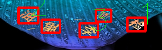
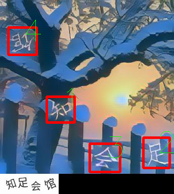
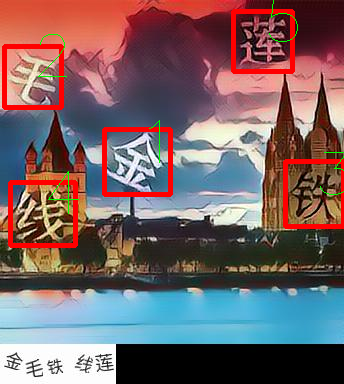

# 点击选择验证码破解

该程序使用Yolo定位验证码文字，再通过训练一个文字分类器从而达到识别点击选择验证码的目的

[详细教程](https://cos120.github.io/crack/)

## 数据集问题

[数据集issue](https://github.com/cos120/captcha_crack/labels/dataset)

## 如何使用

查看`run.sh`, 提供训练定位以及识别命令。基本配置参数见[darknet](https://pjreddie.com/darknet/)

**注意分类器label是从文件名的绝对路径中查找的，一定要保证label只在路径中出现一次**

`python/server.py`可以提供通过url进行识别破解的demo（针对网易点选验证码）

## 效果

### 网易点选验证码

### 极验

需要做字符分割后再进行破解

## 免责声明

**该项目仅用于学术交流，不得任何商业使用！**

